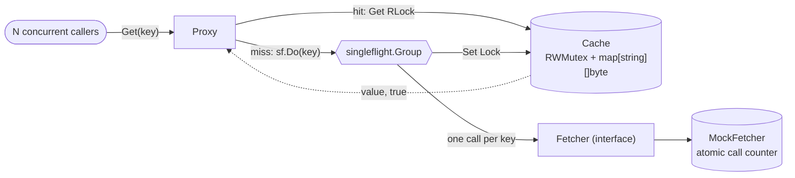
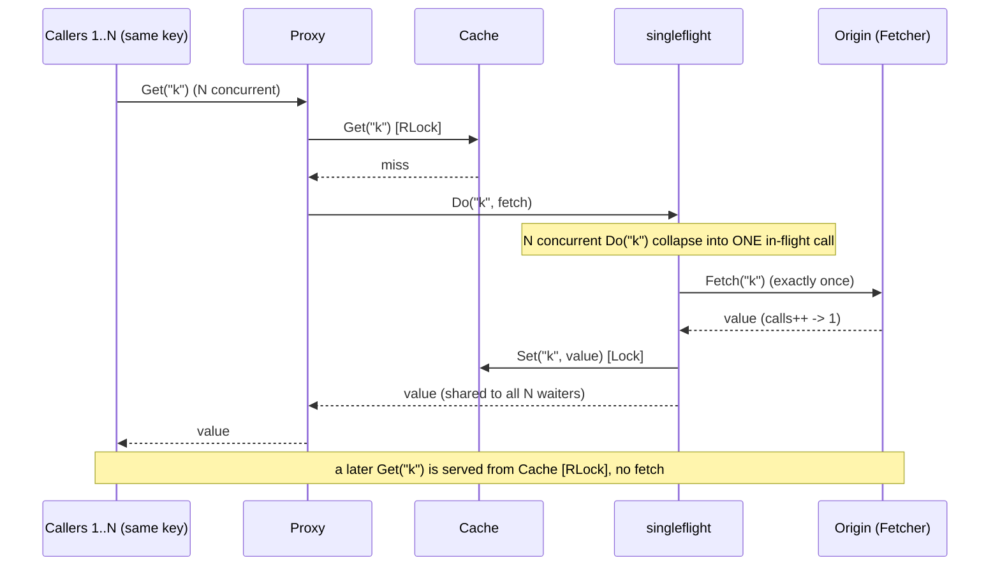
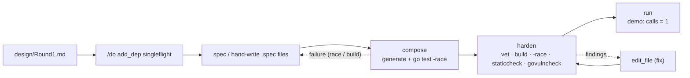

# Round 1 - Highly Concurrent Memory-Cached Proxy (most basic)

## Purpose of the app

A concurrent, in-memory caching proxy: requests for a key are served from an in-memory cache; a miss
fetches the value once from an upstream origin, stores it, and serves it. The hard part - and the point
of the app - is doing this correctly under heavy concurrency:

- many goroutines read the cache at once (a plain Go map would `fatal error: concurrent map ...`),
- a burst of concurrent misses for the SAME key must not stampede the origin with N identical fetches.

Round 1 builds the smallest correct core that demonstrates those two things, verified under the race
detector. Later rounds push it (HTTP server, TTL, eviction, sharding, benchmarks).

## Why build it with Ratchet (the harness)

This project is the ideal stress test for the ratchet, because the bugs this domain is punishing about
are exactly the ones a deterministic oracle catches that "it compiles" never would:

- The behavior oracle runs **`go test -race`**, so a data race fails the build - the ratchet cannot hand
  back racy code that merely happens to pass once.
- **`harden`** runs `govulncheck` over the third-party `singleflight` dependency, so the dep is
  CVE-checked, not trusted.
- Generation is **grounded** in the KB built for exactly this: the `worker-pool` recipe, the
  `atomic-int64-alignment` and `channel-deadlock` pitfalls, the concurrency guidelines, and `add_dep`'s
  ingest of the real `singleflight` API.
- The loop is **spec -> compose -> harden -> run**, then `edit_file` for the later rounds - we design
  here, the local model writes it, the oracle proves it.

In short: a concurrency-hard systems project is where "verify, don't assert" earns its keep, and where
the ratchet's `-race` gate + grounded generation should outperform unguided generation.

## Round 1 scope (most basic) - and what is deferred

IN (Round 1): the concurrent cache-proxy core + a runnable demo + a race test.
DEFERRED (later rounds, via `edit_file`):
- HTTP server front-end (serve the proxy over HTTP, production `http.Server` + graceful shutdown) - R2.
- TTL / lazy expiry - R2/R3.
- Bounded cache + eviction (the unbounded map is a known R1 limitation - the "memory leak" to fix) - R3.
- Sharded cache (N shards) to cut lock contention - R3, after benchmarking the single mutex.
- Benchmarks + pprof under load - R3.
- `context.Context` on `Fetch` - R2.

## Decisions locked for Round 1

| Decision | Round 1 choice |
|---|---|
| Cache structure | a single `sync.RWMutex` + `map[string][]byte` (benchmark before sharding, later) |
| Value vs pointer | store `[]byte` by VALUE (immutable after fetch -> no shared-state corruption); pointer receivers on `Cache` (holds the mutex) |
| Stampede protection | `golang.org/x/sync/singleflight` |
| TTL / eviction | none yet (deferred) |
| Verification | a concurrent `go test -race` test asserting single-flight collapse + correctness |

## Architecture (diagrams)

Component view - who holds whom, and which lock each path takes:



Request lifecycle - the stampede collapse is the whole point (N concurrent misses on one key -> ONE
fetch):



## The specs (Round 1 units)

Five units. All in `package main` at the module root (Round 1 model); the entry is a small demo that
later rounds replace with the HTTP server. Dependency order: fetcher -> cache -> proxy -> (main, test).

### 1. `Fetcher` (interface + mock)  - role: interface
- `type Fetcher interface { Fetch(key string) ([]byte, error) }` - the upstream/origin abstraction.
- `type MockFetcher struct{ calls atomic.Int64; delay time.Duration }` - a deterministic origin for the
  test: returns `[]byte("value:"+key)`, sleeps `delay` to widen the race window, and counts every call
  with `atomic.Int64` (typed atomic, alignment-safe).
- `func NewMockFetcher(delay time.Duration) *MockFetcher`
- `func (m *MockFetcher) Fetch(key string) ([]byte, error)` - increments calls, returns the value.
- `func (m *MockFetcher) Calls() int64` - `m.calls.Load()`.
- constraints: stdlib only (sync/atomic, time); package main.

### 2. `Cache` - role: data
- `type Cache struct { mu sync.RWMutex; data map[string][]byte }`
- `func NewCache() *Cache` - initializes the map (a nil map write would panic).
- `func (c *Cache) Get(key string) ([]byte, bool)` - `RLock`; comma-ok read.
- `func (c *Cache) Set(key string, val []byte)` - `Lock`; store.
- constraints: stdlib only (sync); package main; POINTER receivers (holds a mutex, must not be copied);
  store the value as given (the payload is treated as immutable).

### 3. `Proxy` - role: component
- `type Proxy struct { cache *Cache; fetcher Fetcher; sf singleflight.Group }`
- `func NewProxy(c *Cache, f Fetcher) *Proxy`
- `func (p *Proxy) Get(key string) ([]byte, error)`:
  1. `if v, ok := p.cache.Get(key); ok { return v, nil }`  (fast path, read lock)
  2. miss: `v, err, _ := p.sf.Do(key, func() (any, error) { b, e := p.fetcher.Fetch(key); if e == nil { p.cache.Set(key, b) }; return b, e })`
  3. `if err != nil { return nil, err }; return v.([]byte), nil`
- constraints: uses `github.com/go-chi`... no - `golang.org/x/sync/singleflight`; package main; pointer
  receivers; the singleflight call collapses concurrent misses for the same key into one Fetch.

### 4. `App` (entry) - role: behavior  -> main.go
- `func main`: build a `MockFetcher` (small delay), a `Cache`, a `Proxy`; launch ~100 goroutines that all
  `proxy.Get("k")` concurrently (a `sync.WaitGroup`); after they finish, print the value once and the
  fetcher's `Calls()` count - which should be 1, demonstrating the herd was collapsed.
- constraints: stdlib (sync, fmt); package main; func main only here.

### 5. `ProxyTest` (test, role: test) -> proxy_test.go
- `func TestSingleFlightCollapsesHerd(t *testing.T)`: `MockFetcher` with a delay; `Proxy`; launch 200
  goroutines all calling `Get("same")` via a `WaitGroup`; assert every returned value == `value:same`
  and `fetcher.Calls() == 1` (the herd collapsed to one fetch).
- `func TestCacheHitNoRefetch(t *testing.T)`: `Get("k")` twice; assert `Calls() == 1` (second is a hit).
- `func TestDistinctKeys(t *testing.T)`: concurrent `Get` over 5 distinct keys, many goroutines each;
  assert `Calls() == 5` (one fetch per unique key).
- constraints: stdlib (sync, testing, bytes); package main; relies on `go test -race` (the oracle) to
  prove no data race - do NOT add manual sleeps to "fix" races.

Dependency to add before composing: `golang.org/x/sync/singleflight` (`/do add_dep cacheproxy
golang.org/x/sync/singleflight`).

## Definition of Done (Round 1)

Round 1 is done when ALL of these hold:

1. `compose` builds every unit; the module passes `go build ./...` and **`go test -race ./...`**.
2. `harden` (`/flow harden --ws cacheproxy`) reports **PRODUCTION-CLEAN**: gofmt, vet, build,
   `go test -race`, staticcheck, and `govulncheck` (over the singleflight dep) all green.
3. The test proves the two core properties:
   - **No data race** under `-race` (concurrent cache reads/writes are safe).
   - **Single-flight collapse**: 200 concurrent misses on one key -> `Calls() == 1`; 5 distinct keys ->
     `Calls() == 5`; a warm key -> no refetch.
4. `run` (`/flow run --ws cacheproxy`) executes the demo `main` and prints `calls = 1` for the
   concurrent same-key burst.

Not required in Round 1 (explicitly deferred): HTTP serving, TTL, eviction/bounding, sharding,
benchmarks, context.

## Build + verify plan (the ratchet sequence)



```
/do add_dep cacheproxy golang.org/x/sync/singleflight     # pull + ingest its docs into the deps KB
ratchet flow . spec    --ws cacheproxy "<this design, per unit>"   # or hand-write the 5 .spec files
# review the specs against this doc
ratchet flow . compose --ws cacheproxy ""                 # generate + build + go test -race
ratchet flow . harden  --ws cacheproxy ""                 # full gate incl govulncheck
ratchet flow . run     --ws cacheproxy ""                 # demo: calls = 1
```
