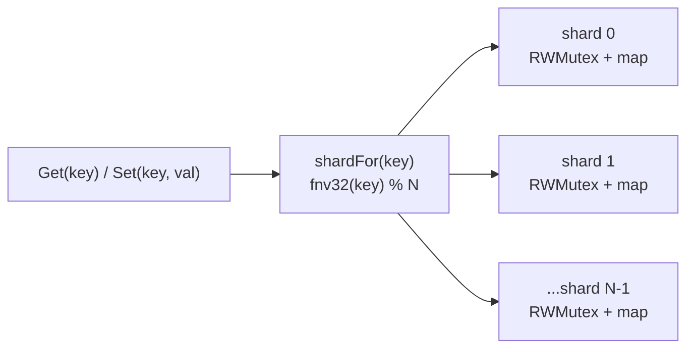
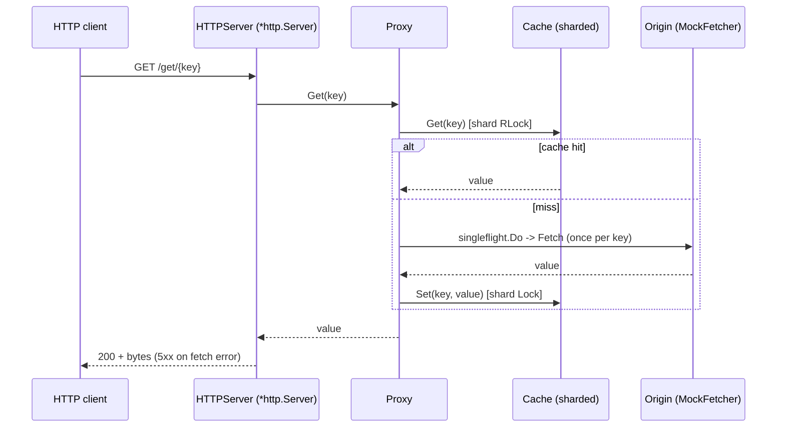

# Round 2 - turn the core into a real, high-throughput, measured server (by editing)

Round 1 built the concurrent cache-proxy core (greenfield `compose`). Round 2 grows the SAME codebase
through edits, to push the harder case: incremental changes to existing, interdependent units. The point
is as much about exercising the ratchet's edit loop on real code as it is about the features.

## Why edits (not a new compose)

Greenfield generation is the easy case. The hard, daily case is changing code that other code depends
on. Round 2 deliberately includes:
- an **additive** change (new file, nothing breaks) - the HTTP server,
- an **API-stable internal refactor** (rewrite internals, keep the contract) - the sharded cache,
- and a **cross-cutting** change that ripples across files - `context` propagation - to find the edge
  of the one-file `edit_file` model.

Each edit is oracle-gated: `stage_check` runs `go vet` + `go test -race` over the whole module, so a
change that breaks a caller or introduces a race is rejected.

## Scope - and what stays deferred

IN (Round 2):
1. HTTP server front-end + production `http.Server` (timeouts + graceful shutdown).
2. Sharded cache (cut lock contention) - same `Get`/`Set` contract.
3. Benchmarks (`b.RunParallel`) + optional `net/http/pprof`.
4. Stretch / probe: thread `context.Context` through `Fetcher.Fetch` and `Proxy.Get`.

DEFERRED (Round 3+): TTL / lazy expiry; bounded cache + LRU eviction (the real memory-leak fix); a real
HTTP origin Fetcher (Round 2 keeps the MockFetcher as the origin); deep pprof analysis.

## Decisions locked for Round 2

| Decision | Round 2 choice |
|---|---|
| Origin | keep the `MockFetcher` (a real HTTP origin is Round 3) |
| Routing | `http.ServeMux` with `GET /get/{key}` (Go 1.22 method+path), key via `r.PathValue("key")` |
| Server | production `*http.Server` (ReadHeaderTimeout/ReadTimeout/WriteTimeout/IdleTimeout) + `signal.NotifyContext` graceful shutdown |
| Cache sharding | a fixed power-of-two shard count (e.g. 32), key -> shard by FNV hash; `Get`/`Set` signatures UNCHANGED |
| Benchmarks | `b.RunParallel` for `Get`, `Set`, and `Proxy.Get` under contention |

## Architecture (diagrams)

Sharded cache - contention is spread across N independently-locked shards instead of one global lock:



Request path once the HTTP layer is in (the cache+singleflight core is unchanged):



## The increments (each a ratchet edit on the live module)

### Increment 1 - HTTP server (additive + one main edit)
- `add_file server.go`: an `HTTPServer` wrapping `*Proxy`; a handler for `GET /get/{key}` that reads the
  key with `r.PathValue("key")`, calls `proxy.Get(key)`, writes the bytes (200) or `http.Error` 5xx on a
  fetch error; a `Routes()` returning an `http.ServeMux`.
- `edit_file main.go`: replace the concurrent demo with a production `*http.Server` serving `Routes()`,
  timeouts set, graceful shutdown via `signal.NotifyContext` (+ ` dispatcher`? no - this proxy has no
  worker pool; just `srv.Shutdown`). Grounded on the production-http-server pattern.
- verify: `harden`, then `run` (logs "listening"), then a real `curl GET /get/k`.

### Increment 2 - sharded cache (API-stable internal refactor)
- `edit_file cache.go`: replace the single `RWMutex` + map with an array of N shards, each its own
  `RWMutex` + map; `Get`/`Set` hash the key (FNV) to a shard and lock only that shard. KEEP the exact
  `Get(key) ([]byte, bool)` / `Set(key, []byte)` signatures so `Proxy` and the test are untouched.
- verify: the EXISTING `go test -race` must still pass (the contract held); `harden`.

### Increment 3 - benchmarks (additive)
- `add_file cache_bench_test.go`: `BenchmarkCacheGet`, `BenchmarkCacheSet`, `BenchmarkProxyGet`, each
  using `b.RunParallel` to drive concurrent load.
- optional `edit_file main.go`: import `net/http/pprof` so the server exposes `/debug/pprof`.
- verify: `go test -bench . -benchmem` runs and reports.

### Stretch / probe - context propagation (cross-cutting)
- thread `context.Context` through `Fetcher.Fetch(ctx, key)` and `Proxy.Get(ctx, key)`, updating all
  callers (server, main, test). EXPECTATION: a single `edit_file` on the fetcher will fail `stage_check`
  because the module won't compile until every caller is updated. Document the outcome - if it can't be
  done one file at a time, that is the evidence for a new **multi-file / transactional edit** flow.

## Definition of Done (Round 2)

1. Increments 1-3 each land via `edit_file`/`add_file`, oracle-verified (`go vet` + `go test -race`).
2. `harden` reports PRODUCTION-CLEAN after each increment and at the end.
3. The HTTP server serves: `curl GET /get/{key}` returns the value; a second request is a cache hit.
4. Sharded cache: the existing concurrency/single-flight test still passes under `-race` (contract
   preserved), and `go test -bench` reports `Get`/`Set` throughput under parallel load.
5. `run` starts the server cleanly (logs listening; stopped after the timeout).
6. The `context` probe is attempted and its outcome (success, or the multi-file-edit finding) recorded
   in the transcript.

## Build plan (one ratchet command at a time, transcripts captured)

```
ratchet flow . add_file  --ws cacheproxy "server.go ..."          # increment 1a
ratchet flow . edit_file --ws cacheproxy "main.go ... http.Server"# increment 1b
ratchet flow . harden    --ws cacheproxy ""                       # gate
ratchet flow . edit_file --ws cacheproxy "cache.go shard it ..."  # increment 2
ratchet flow . harden    --ws cacheproxy ""                       # gate (contract held? race clean?)
ratchet flow . add_file  --ws cacheproxy "cache_bench_test.go ..."# increment 3
# then the context probe
```
